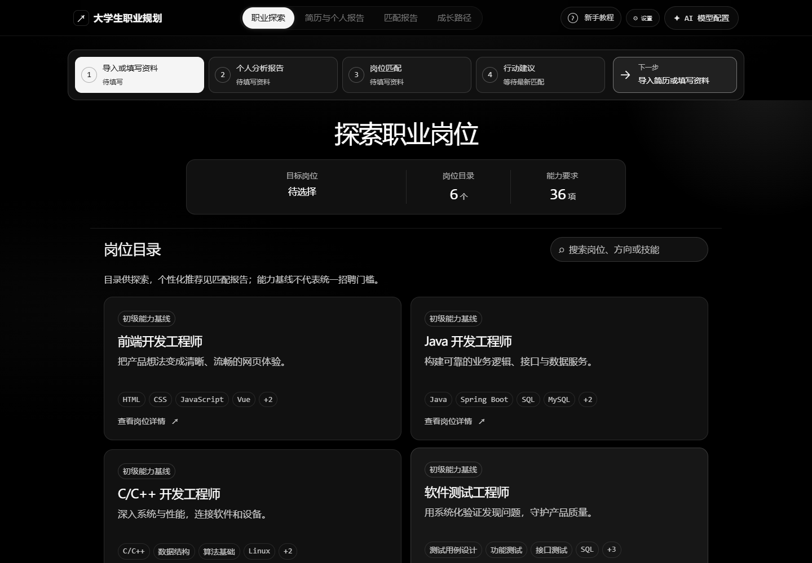

# 基于 AI 的大学生职业规划智能体

一个在自己电脑上运行的职业探索工具：整理你的资料，对照岗位要求，查看匹配依据和成长路线，再按需让 AI 帮你写行动建议。

目前覆盖 **前端开发、Java 开发、C/C++ 开发、软件测试、软件实施、技术支持** 六类 IT 岗位，使用赛题原始招聘数据中选出的 240 条样本。适合课程、比赛演示和个人探索。

**匹配分由固定规则计算；AI 负责整理资料和生成建议。** 分数表示资料与岗位要求的覆盖程度，不能证明真实能力，也不代表录用概率。

[安装运行](#快速开始windows) · [功能与限制](#功能与当前状态) · [完整使用指南](docs/项目使用全过程.md) · [公开文件范围](docs/仓库文件管理.md)

## 界面预览

职业探索页展示岗位目录。个人化的岗位推荐在「匹配报告」中查看；上图来自本机实际应用，没有调用 AI。

## 功能与当前状态

| 功能 | 能做什么 | 是否需要模型 |
| --- | --- | --- |
| 职业探索 | 查看六类岗位的必需项、优先项及数据依据 | 不需要 |
| 手动整理资料 | 填写专业、经历、技能、证书和素质 | 不需要 |
| 匹配与推荐 | 计算基础/增强匹配分，按城市、薪资、技能筛选，最多推荐五个岗位 | 不需要 |
| 成长路径 | 浏览晋升与转岗路线，选择并保存本机行动计划 | 不需要 |
| 简历导入 | 从文字版 PDF、DOCX、TXT 中提取资料，支持修改和删除提取结果 | 需要 |
| 个人分析与岗位建议 | 根据当前资料生成分析报告和行动建议 | 需要 |
| 复制与 TXT 导出 | 保存已经生成的报告 | 导出本身不需要；生成 AI 报告需要 |

当前算法为 `matching-2.2`。已有后端、前端和浏览器自动化检查；**真实模型供应商调用仍待验证**，浏览器测试使用模拟模型响应。岗位要求等级只用于展示，尚不具备对学生熟练程度的完整判断。验收范围见 [项目稳定性验收](docs/acceptance/项目稳定性验收.md)与 [真实模型验收](docs/acceptance/真实模型验收.md)。

## 快速开始（Windows）

准备 Git、Python **3.12**、Node.js **22.12.0 或更高版本**（含 npm），在 PowerShell 依次运行：

~~~powershell
git clone https://github.com/14866312/career-matching-agent.git
cd career-matching-agent
./install.ps1
./start.ps1
~~~

浏览器打开 **[http://127.0.0.1:8000](http://127.0.0.1:8000)**。首次安装需要联网；之后通常只需运行 `./start.ps1`。在服务窗口按 `Ctrl+C` 停止。端口被占用时，使用 `./start.ps1 -Port 8001`，再打开 [http://127.0.0.1:8001](http://127.0.0.1:8001)。

**先试不需要 AI 的流程：**

1. 首次进入，选择「本次不保存」或「自动保存」，再选择开始入口。
2. 在「职业探索」打开「Java 开发工程师」详情并设为目标岗位。
3. 在「简历与个人报告」选择手动录入，填写专业，添加 Java、SQL 等技能。
4. 在「匹配报告」查看分数、资料已提及/未提及项及推荐；在「成长路径」查看后续路线。

生成个人分析报告和行动建议需要模型配置；手动匹配可以直接使用。详细操作见 [项目使用全过程](docs/项目使用全过程.md)。

## 接入 AI 模型（可选）

准备一个兼容 OpenAI 接口的模型服务，在项目根目录执行：

~~~powershell
Copy-Item .env.example .env
notepad .env
~~~

在本机填写 `LLM_BASE_URL`（服务地址）、`LLM_MODEL`（模型名称）和 `LLM_API_KEY`（密钥），保存并重启 `./start.ps1`。界面也提供「AI 模型配置」入口；界面设置仅在当前服务进程有效，不会写回 `.env`。

配置后，可用 `samples/虚构简历.pdf`、`.docx` 或 `.txt` 试用简历导入，核对提取内容，再生成分析或岗位建议。支持文字版文件，单个不超过 **5MB、3 万字符**；扫描件、加密文件不支持，项目没有 OCR。

`.env` 和其他 `.env.*` 配置只留本机，项目仅公开 `.env.example` 模板。模型调用可能产生服务商费用；相关资料会发送给你配置的模型服务。

## 匹配分怎么理解

例如：岗位有四项必需要求，你的资料提到了两项，基础匹配分就是 **2 ÷ 4 = 50%**。这是便于解释的示例，实际岗位会同时包含技能、证书和素质。

- **基础匹配分**：资料提及的必需标签数 ÷ 全部必需标签数。优先项只展示、不计分。
- **增强匹配分**：精确提及项贡献为 1；关联技能最多贡献 0.25，多个关联不叠加。证书与素质按是否提及计算。
- 多写岗位不要求的技能不会降低分数；同一标签重复填写只计一次。
- **资料未提及不代表不会，资料提及也不代表能力已经核实。** 可以补充资料后重新匹配。

推荐最多五个典型岗位，默认按基础分排序。城市与薪资筛选依据样本记录，日薪和月薪不互相换算。完整口径见下方「给开发者」及 [ADR 0002](docs/adr/0002-mentioned-skills-without-confirmation-gate.md)。

## 数据与隐私

岗位画像由只读赛题表格生成：六类岗位各选 40 条支持记录，共 240 条；并非整个原始表格只有 240 条。样本只代表其记录时的情况，**不保证现在仍在招聘**。晋升、转岗与学习活动是人工整理的参考建议，不保证薪资或就业结果。`samples/` 中全部为虚构资料。

应用绑定本机 `127.0.0.1`，不需要账号，也不在服务端保存个人资料：

- 选择「本次不保存」时，资料只保留在当前页面会话。开启自动保存后，整理的资料与路径存在当前浏览器，可在「设置」中清除。
- 简历文件在本机服务中读取后丢弃，不保存原文件或正文日志；使用 AI 解析时，简历文本会发送给配置的服务商。上传前可删去不必要的个人信息。
- 简历姓名仅在当前会话展示和修改，不进入匹配、后续模型请求、本机草稿或导出的报告，刷新后清空；解析请求中的原始简历仍可能含姓名。
- 本机草稿不保存简历原文件、姓名、AI 报告或模型密钥。

## 仓库里放什么

| 公开到 GitHub | 只留在本机 |
| --- | --- |
| 前后端代码、测试、数据重建与安装启动脚本 | `.venv*/`、`node_modules/`、构建输出与缓存 |
| 依赖清单和锁文件、`.env.example`、CI 配置 | `.env`、`.env.*`、编辑器和 AI 工具私有设置 |
| 运行所需岗位 JSON、虚构样例、已确认公开的赛题原件 | 真实简历、个人资料、临时日志与原始测试输出 |
| 使用指南、接口/数据说明、ADR、精选验收证据 | `本地资料/` 中的工单、方案、PPT、Word、笔记与个人工作记录 |

本地比 GitHub 多出这些目录是正常现象。具体归档决定、例外与核对命令见 [仓库文件管理](docs/仓库文件管理.md)。

## 给开发者

项目结构、检查命令与完整评分规则（点击展开）

后端为 FastAPI / Python 3.12，前端为 React / TypeScript / Vite。生产入口由 FastAPI 在同一端口提供 API 和构建后的前端。

| 目录 | 内容 |
| --- | --- |
| `backend/app/` | API、模型适配、简历提取与确定性匹配 |
| `backend/data/` | 脚本生成的岗位数据，勿手工修改 |
| `frontend/src/` | 页面、组件、会话逻辑、样式和前端测试 |
| `scripts/` | 数据与虚构样例重建、真实模型 smoke |
| `tests/` | 后端测试；`tests/browser/` 为 Playwright 验收 |
| `samples/`、`competition/` | 虚构样例与只读赛题原件 |
| `docs/` | 使用指南、契约、数据说明、ADR、验收和协作记录 |

### 检查与开发

~~~powershell
.venv/Scripts/python.exe -m pytest tests -q
.venv/Scripts/python.exe -m ruff check backend scripts tests
npm.cmd --prefix frontend test
npm.cmd --prefix frontend run lint
npm.cmd --prefix frontend run build
~~~

改前端后重新构建并重启服务。开发时运行 `npm.cmd --prefix frontend run dev`，打开 [http://localhost:5173](http://localhost:5173)，后端同时运行在 8000。样式位于 `frontend/src/styles/`，按原级联顺序导入，使用系统字体。

### 浏览器验收

~~~powershell
npm.cmd ci --prefix tests/browser

# 终端一：测试服务器，端口 8011，AI 返回固定模拟响应
.venv/Scripts/python.exe tests/e2e_server.py

# 终端二：结果写入忽略目录，避免改写公开证据
$env:E2E_OUTPUT_DIR = Join-Path (Get-Location) 'tmp/browser-acceptance'
npm.cmd --prefix tests/browser test
npm.cmd --prefix tests/browser run test:ui
npm.cmd --prefix tests/browser run test:a11y
~~~

本机默认使用 Edge；切换 Chromium 可设置 `$env:PW_CHANNEL = 'chromium'` 并先执行 `tests/browser/node_modules/.bin/playwright.cmd install chromium`。不设置 `E2E_OUTPUT_DIR` 时会更新 `docs/acceptance/`，只在有意刷新公开证据时使用。

浏览器测试只替换模型响应，不能证明供应商可用。配置模型并正常启动生产服务后，运行 `.venv/Scripts/python.exe scripts/smoke_live.py`；退出码 **0 为成功、1 为失败、2 为缺少配置且未验证**。CI 每次 PR 运行后端、前端和浏览器三项检查。

### 数据与样例重建

~~~powershell
.venv/Scripts/python.exe scripts/build_data.py

# 仅在有意更新虚构样例时运行，会改写已提交的样例
.venv/Scripts/python.exe -m pip install -r requirements.samples.txt
.venv/Scripts/python.exe scripts/make_samples.py --include-pdf
~~~

岗位数据来自 `competition/岗位样例数据.xls`；脚本同时生成审核文档。PDF 样例工具依赖独立于应用运行依赖。需要独立 Python 环境时，可运行 `./install.ps1 -VenvPath .venv-acceptance -SkipFrontend`，启动时使用相同的 `-VenvPath`。

### 完整评分规则（matching-2.2）

基础分 = 资料（简历或手动填写）已提及且等级大于 0 的必需标签数量 ÷ 必需标签总数。不要求逐项确认或证据。优先项不入分母，多余学生标签不稀释，重复标签只计一次。条目分为「资料已提及」和「资料未提及（不代表不具备）」；旧数据中的等级 0 按未提及处理。

增强分中精确提及项贡献为 1，不按学生自评等级折算。岗位要求等级映射为了解/熟悉/熟练 → 1/2/3，无明确文字默认 2，只用于展示。关联技能最多贡献 0.25，多个不叠加，不代表已掌握。证书和素质按是否提及计 0/1。空维度显示不适用；全部无要求则不可计算并排除推荐。

最多推荐五个典型岗位，默认按基础分排序，同分按岗位 ID。城市、薪资针对实际样本记录；同计薪周期区间重叠，日薪/月薪不换算。无薪资条件时保留未知薪资。技能筛选要求全部所选标签出现。候选不足三个时如实展示。

模型调用每次有 45 秒预算，连接错误、429 或 5xx 可自动重试一次，详见 [AI 接口契约](docs/AI接口契约.md)。领域术语见 [CONTEXT](CONTEXT.md)，数据口径见 [数据字典](docs/数据字典.md)，姓名隔离见 [ADR 0001](docs/adr/0001-resume-name-session-boundary.md)。

## 许可证

项目代码以 [MIT License](LICENSE) 发布。`competition/` 的赛题材料版权归原出题方所有，**不在 MIT 授权范围内**。
